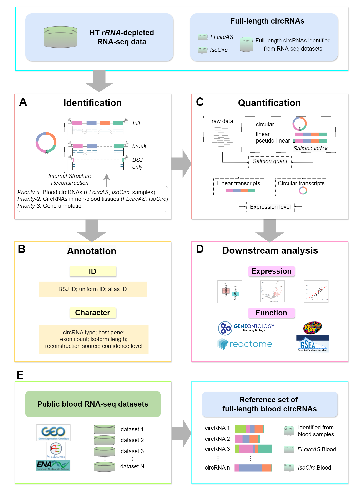

# AQUARIUMHB

A comprehensive toolkit for identifying, annotating, quantifying, and analyzing human blood circular RNAs from RNA-seq data.

{style="width:50%"}

The identification module of AQUARIUMHB consists of three main components:

1. **CircRNA Identification**  
   Based on the `CIRI-full` pipeline. Download the scripts from [AQUARIUMHB scripts](https://github.com/shaoxunyuan/AQUARIUMHB/tree/main/inst/scripts).

2. **Construction of Full-length Reference Set**  
   Utilizes the `MakeReferenceIsoform` function from the R package `AQUARIUMHB`.

3. **Reconstruction of Partial-length circRNAs**  
   Implemented through the `circRNA_full.gtf`, `circRNA_break.gtf`, and `circRNA_only.gtf` functions in the R package.

## Installation

You can install the package directly from GitHub:

```r

# install.packages("devtools")

devtools::install_github("shaoxunyuan/AQUARIUMHB")

```

# Quick Start

For a demonstration workflow using the PRJNA429023 dataset, please refer to:

https://shaoxunyuan.github.io/AQUARIUMHB/

# Bug Reports

If you encounter any issues, have questions, or would like to make suggestions, 
feel free to report them at our [bug tracker](
https://github.com/shaoxunyuan/AQUARIUMHB/issues).

# Contact

For additional inquiries, contact us at: 
Email: yuanshaoxun@njucm.edu.cn


